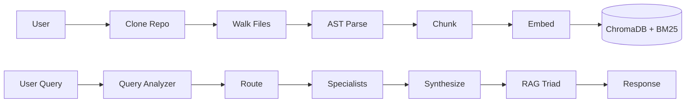

# 🧠 RepoMind

Intelligent multi-agent codebase analysis powered by LangGraph, RAG, and AST-aware code understanding.


## Features

- 🔍 **AST-Aware Code Chunking** — Parses Python (`ast`), JS/TS (`tree-sitter`), with regex fallback
- 🔀 **Hybrid Search** — Dense embeddings + BM25 keywords merged with Reciprocal Rank Fusion
- 🤖 **5 Specialized Agents** — Query Analyzer, Code Retriever, Architect, Bug Hunter, Code Reviewer
- 📊 **RAG Triad Self-Evaluation** — Faithfulness, Context Relevance, Answer Relevance with auto-retry
- 🏗️ **Dependency Graph** — Import/call/inheritance analysis with interactive visualization
- 💰 **100% Free** — No paid APIs required (Gemini Flash free tier + local models)

## Architecture



## Quick Start

```bash
git clone https://github.com/BhushanSah3/RepoMind.git
cd RepoMind
python -m venv .venv
# On Windows:
.venv\Scripts\activate
# On Unix or MacOS:
# source .venv/bin/activate

pip install -r requirements.txt
cp .env.example .env
# Add your GOOGLE_API_KEY to .env
streamlit run app.py
```

## Tech Stack

| Layer | Technology | Notes |
|-------|-----------|-------|
| LLM | Gemini 2.0 Flash | Free tier, with Groq + Ollama fallback |
| Embeddings | all-MiniLM-L6-v2 | Local, 384-dim |
| Vector Store | ChromaDB | Local, persistent |
| Keyword Search | BM25 (rank_bm25) | Code-aware tokenization |
| Reranker | cross-encoder/ms-marco-MiniLM-L-6-v2 | Local |
| Orchestration | LangGraph + LangChain | State machine with parallel agents |
| Code Parsing | Python ast + tree-sitter | Multi-language support |
| Frontend | Streamlit | With PyVis graph visualization |

## Project Structure

```
RepoMind/
├── agents/             # LangGraph workflows and specialized agents
├── app.py              # Streamlit entry point
├── evaluation/         # RAG triad and evaluation metrics
├── indexing/           # Chunking, AST parsing, embeddings
├── llm/                # Provider abstraction (Gemini, Groq, Ollama)
├── .env.example        # Environment variables template
├── requirements.txt    # Project dependencies
└── README.md           # Project documentation
```

## How It Works

RepoMind works by turning your entire codebase into a queryable knowledge graph. First, it walks through the cloned repository, parsing code files into logical chunks using Abstract Syntax Trees (AST). This ensures that functions and classes stay semantically grouped, which is a major advantage over naive text chunking. The chunks are then embedded and indexed into both a dense vector store (ChromaDB) and a keyword search index (BM25).

When you ask a question, the Query Analyzer determines the intent and routes the query. The Code Retriever pulls the most relevant code chunks using Hybrid Search and a cross-encoder reranker. If the question requires specific expertise, it is routed to specialized agents such as the Architect, Bug Hunter, or Code Reviewer, who analyze the retrieved code simultaneously.

Finally, the Synthesizer combines these expert insights into a cohesive answer. Before presenting the answer to you, RepoMind runs a RAG Triad self-evaluation check to ensure the answer is faithful to the context and relevant to your question. If the evaluation fails, RepoMind adapts its retrieval strategy and retries the process autonomously.

## Contributing

Contributions are welcome! Please open an issue first to discuss what you would like to change. 
Ensure that your pull requests pass existing linting and formatting standards.

## License

MIT
