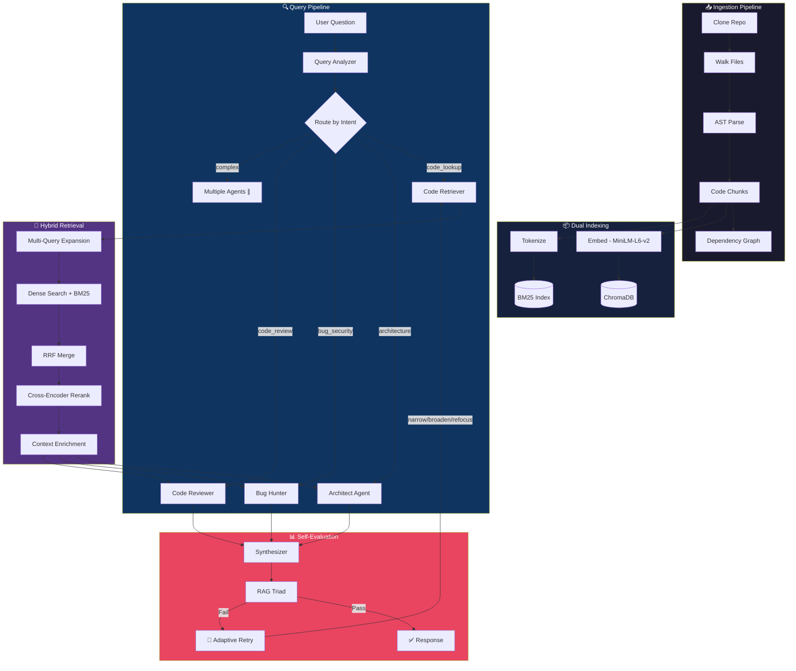

# 🧠 RepoMind

**Intelligent multi-agent codebase analysis powered by LangGraph, RAG, and AST-aware code understanding.**


---

## 📖 Project Overview

### What is RepoMind?

RepoMind is a multi-agent Retrieval-Augmented Generation (RAG) application that lets you **have a conversation with any GitHub repository**. Point it at a public GitHub URL, and RepoMind will clone the repo, parse every file using Abstract Syntax Trees (AST), index the code into a hybrid search engine, and let you ask questions that get routed to specialized AI agents — each one an expert in a different aspect of code analysis.

### The Problem

Understanding an unfamiliar codebase is one of the hardest problems in software engineering. Developers spend **~60% of their time reading and understanding code**, not writing it. Existing tools either:

- **Generic chatbots** (ChatGPT, Copilot Chat) — paste code manually, no repo-wide context, no structured analysis
- **Code search tools** (Sourcegraph, grep) — find text matches, but don't understand semantics or architecture
- **Static analyzers** (SonarQube, ESLint) — rule-based, no natural language interaction, no architectural insight

### Why RepoMind Was Built

RepoMind bridges the gap between "grep for a string" and "understand the entire codebase." It was built as a portfolio project to demonstrate:

1. **Advanced RAG beyond basic tutorials** — AST-aware chunking, hybrid search, cross-encoder reranking, multi-query expansion
2. **Multi-agent orchestration** — 5 specialist agents running in parallel via LangGraph state machines
3. **Self-evaluation and self-correction** — RAG Triad (Faithfulness, Context Relevance, Answer Relevance) with adaptive retry
4. **Production engineering patterns** — fallback chains, graceful degradation, observable pipelines

### What Makes RepoMind Unique

| Feature | Basic RAG Tutorial | RepoMind |
|---------|-------------------|----------|
| Chunking | Naive text splitting | AST-aware (functions, classes, modules) |
| Search | Single vector similarity | Hybrid (Dense + BM25 + RRF + Cross-encoder reranking) |
| Analysis | Single LLM call | 5 parallel specialist agents via LangGraph |
| Quality | No evaluation | RAG Triad self-evaluation with adaptive retry |
| Context | No cross-file awareness | Dependency graph (imports, calls, inheritance) |
| Cost | Paid API required | 100% free tier (Gemini Flash + local models) |

---

## 🤔 Why You Should Use This Repository

### Who Benefits

- **Developers** exploring unfamiliar codebases — ask natural language questions instead of reading every file
- **Students** learning advanced RAG — see how AST chunking, hybrid search, multi-agent orchestration, and self-evaluation work together in a real system
- **Job seekers** — fork this as a portfolio project that demonstrates production-grade AI engineering (not just a "chat with PDF" tutorial)
- **Code reviewers** — get instant architectural analysis, bug detection, and best practices assessment

### What You Can Learn

By studying RepoMind's codebase, you'll understand:

- How to build **AST-aware code chunking** (Python `ast` module + Tree-sitter for JS/TS)
- How to implement **Hybrid Search with Reciprocal Rank Fusion** (Dense embeddings + BM25 keywords)
- How to orchestrate **parallel multi-agent workflows** with LangGraph's `StateGraph`
- How to build **RAG Triad self-evaluation** (Faithfulness, Context Relevance, Answer Relevance)
- How to handle **LLM provider fallback chains** (Gemini → Groq → Ollama)
- How to create an **observable pipeline** where every step is visible to the user

### What Makes It Different

RepoMind is **not** a wrapper around an LLM API. It's a complete RAG pipeline with:

- **27 source files** across 9 architectural components
- **45 unit tests** covering chunking, retrieval, agents, and evaluation
- **Dependency graph analysis** using NetworkX with interactive PyVis visualization
- **Adaptive retry** — when the answer quality is low, it automatically adjusts the retrieval strategy and tries again
- **Safety filter handling** — detects when LLMs refuse security analysis and provides fallback static analysis

---

## 🏗️ Architecture



### How the Pipeline Works

1. **Ingestion**: Clone the repo → walk files (skip binaries, node_modules, .git) → parse with AST (Python `ast`, Tree-sitter for JS/TS, regex fallback) → produce semantic chunks (functions, classes, modules, markdown sections) → build dependency graph (imports, calls, inheritance)

2. **Indexing**: Embed chunks with `all-MiniLM-L6-v2` (384-dim, local) → store in ChromaDB (vector) + BM25 (keyword) for hybrid search

3. **Query Processing**: Classify intent (code_lookup, architecture, bug_security, code_review, general) → expand query into 3 variants → retrieve from both indexes → merge with Reciprocal Rank Fusion → rerank with cross-encoder → enrich with dependency context (related modules, importers, test files)

4. **Agent Analysis**: Route to 1-2 specialist agents running in parallel → each analyzes retrieved code with its expertise → synthesizer combines outputs into a coherent answer

5. **Self-Evaluation**: RAG Triad checks Faithfulness, Context Relevance, and Answer Relevance → if any score is below 0.7, identifies the weakest metric and adapts strategy:
   - Low faithfulness → `narrow` (fewer, more precise chunks)
   - Low context relevance → `broaden` (more chunks, wider search)
   - Low answer relevance → `refocus` (re-prompt with focus instructions)
   - Retries up to 2 times with the adapted strategy

---

## ⚡ Tech Stack

| Layer | Technology | Notes |
|-------|-----------|-------|
| **LLM (Primary)** | Gemini 3.6 Flash | Free tier via Google AI Studio |
| **LLM (Fallback)** | Qwen 3.8-27B via Groq | Free tier, 131K context, auto-failover |
| **LLM (Local)** | Ollama (llama3.1) | Optional, fully offline |
| **Embeddings** | all-MiniLM-L6-v2 | Local, 384-dim, runs on CPU |
| **Vector Store** | ChromaDB | Local, persistent, cosine similarity |
| **Keyword Search** | BM25 (rank_bm25) | Code-aware tokenization (camelCase, snake_case) |
| **Reranker** | cross-encoder/ms-marco-MiniLM-L-6-v2 | Local cross-encoder, max_length=512 |
| **Orchestration** | LangGraph + LangChain | StateGraph with conditional routing, parallel fan-out |
| **Code Parsing** | Python `ast` + tree-sitter | Multi-language support (Python, JS, TS) |
| **Graph Analysis** | NetworkX + PyVis | Import/call/inheritance graphs with interactive visualization |
| **Frontend** | Streamlit | Charts, PyVis embeds, agent traces, API key management |

**Total cost to run: $0** — All models have free tiers or run locally.

---

## 🚀 Installation and Setup

### Prerequisites

- **Python 3.10+** (tested with 3.12)
- **Git** (for cloning repositories)
- **A Google API key** (free, for Gemini LLM) — [Get one here](https://aistudio.google.com/apikey)
- *Optional*: A Groq API key (free, for fallback LLM) — [Get one here](https://console.groq.com)

### Step 1: Clone RepoMind

```bash
git clone https://github.com/BhushanSah3/RepoMind.git
cd RepoMind
```

### Step 2: Create a Virtual Environment

```bash
python -m venv .venv

# Windows
.venv\Scripts\activate

# macOS / Linux
source .venv/bin/activate
```

### Step 3: Install Dependencies

```bash
pip install -r requirements.txt
```

This installs ~19 packages including LangChain, LangGraph, Streamlit, ChromaDB, sentence-transformers, tree-sitter, PyVis, and others. The first run will also download the embedding model (`all-MiniLM-L6-v2`, ~90MB) and the reranker model (`ms-marco-MiniLM-L-6-v2`, ~90MB) automatically.

### Step 4: Configure API Keys

```bash
cp .env.example .env
```

Edit `.env` and add your API keys:

```env
# Required — Primary LLM (Gemini Flash, free tier)
GOOGLE_API_KEY=your_google_api_key_here

# Optional but recommended — Fallback LLM (Groq, free tier)
GROQ_API_KEY=your_groq_api_key_here

# Default provider (gemini, groq, or ollama)
DEFAULT_LLM_PROVIDER=gemini

# Only needed if using Ollama (local LLM)
OLLAMA_BASE_URL=http://localhost:11434
OLLAMA_MODEL=llama3.1
```

> **💡 Tip**: You can also enter API keys directly in the Streamlit sidebar — no `.env` file editing needed.

### Step 5: Run the Application

```bash
streamlit run app.py
```

The app will open in your browser at `http://localhost:8501`.

---

## 📘 How to Use RepoMind

### Step 1: Enter Your API Key

When the app loads, you'll see the sidebar with **🔑 API Keys** at the top.

- Enter your **Google API Key** (required — powers Gemini Flash)
- Optionally enter your **Groq API Key** (recommended — acts as a fallback when Gemini is rate-limited)

The sidebar shows the **Fallback Chain** status:
- ✅ Gemini — key configured
- ✅ Groq — key configured (or ❌ if missing)

### Step 2: Ingest a Repository

1. Paste a public GitHub URL in the **Repository** section (e.g., `https://github.com/BhushanSah3/Sensei_Search`)
2. Click **🔄 Ingest Repo**
3. Watch the real-time ingestion progress:
   - ✅ Cloned repository
   - ✅ Scanned X files (python: N, markdown: N, ...)
   - ✅ Created X chunks (function: N, class: N, module: N)
   - ✅ Built dependency graph (N nodes, N edges)
   - ✅ Embeddings generated
   - ✅ BM25 index built
   - ✅ Persisted to disk
   - ✅ Workflow compiled

After ingestion, the sidebar shows **Index Statistics**: file count, chunk count, detected languages, and collection slug.

### Step 3: Explore the Dashboard

Click the **Dashboard** tab to see:
- **Repository Analytics** — Total files, indexed chunks, languages detected, average file size
- **Language Distribution** — Bar chart showing how many files per language
- **Chunk Type Breakdown** — Bar chart showing function/class/module/markdown chunk counts
- **Files Explorer** — Searchable table of all indexed files with language and size

### Step 4: Explore the Dependency Graph

Click the **Graph** tab to see:
- **Architecture Summary** — File count, most connected files, entry points, leaf modules, circular dependencies
- **Interactive Visualization** — PyVis network graph with:
  - **Blue boxes** = files, **Green dots** = classes, **Yellow dots** = functions
  - **Blue edges** = imports, **Orange edges** = calls, **Red edges** = inheritance, **Gray edges** = contains
  - Filter checkboxes to show/hide files, classes, and functions
  - Drag nodes, zoom in/out, hover for details

### Step 5: Ask Questions

Click the **Chat** tab and type your question. RepoMind will:
1. **Classify your intent** (what kind of question is this?)
2. **Retrieve relevant code** (hybrid search + reranking)
3. **Route to specialist agents** (1-2 agents in parallel)
4. **Synthesize the answer** (combine agent outputs)
5. **Self-evaluate** (RAG Triad check)
6. **Retry if needed** (adaptive strategy adjustment)

You can see all of this happening in real time in the **processing status bar**.

---

## 🎯 Which Questions Trigger Which Agents

### 🧠 Query Analyzer → General Response
These bypass retrieval entirely. Good for testing that the system is working.

```
hello
hi there
what can you do?
```

**What happens**: Intent = `general` → No retrieval → Canned response suggesting questions to ask.

---

### 🔍 Code Retriever → Direct Code Lookup
Simple "where is X" or "what does Y do" questions. The Code Retriever fetches code and the Synthesizer generates the answer.

```
Where is the main entry point of the application?
What does the app.py file do?
How is the chatbot initialized?
What functions are defined in this project?
Show me the database connection code
```

**What happens**: Intent = `code_lookup` → Hybrid Search (8 chunks) → Cross-encoder rerank → Synthesizer generates answer with file paths and code citations.

**Example output**: A detailed explanation of how the app initializes, citing specific file paths, line numbers, and code snippets.

---

### 🏗️ Architect Agent → Architecture & Design
Triggers when the question is about structure, design, patterns, or dependencies. Gets the full dependency graph for cross-file analysis.

```
How is the project structured?
What is the overall architecture of this codebase?
What design patterns are used?
How do the modules depend on each other?
Explain the data flow in this application
```

**What happens**: Intent = `architecture` → Code Retriever → Architect Agent (with dependency graph context) → Synthesizer → Full architectural analysis with component diagrams and dependency chains.

---

### 🐛 Bug Hunter → Security & Robustness Review
Triggers on security, bug, vulnerability, or risk keywords. Performs a defensive code review evaluating input validation, error handling, configuration management, and resource safety.

```
Are there any security vulnerabilities?
Find potential bugs in this code
Check for authentication issues
Are there any hardcoded secrets or credentials?
What are the security risks in the API endpoints?
```

**What happens**: Intent = `bug_security` → Code Retriever → Bug Hunter (with dependency graph for data flow tracing) → Categorized findings with severity (Critical/High/Medium/Low), file/line citations, code evidence, impact analysis, and concrete remediation code.

> **Note**: If Gemini's content safety filter blocks the analysis, RepoMind automatically detects the refusal, shows an explanation, and provides a rule-based static analysis as a fallback.

---

### 📋 Code Reviewer → Code Quality Assessment
Triggers on review, improve, refactor, quality, or documentation keywords. Evaluates code quality across 5 categories.

```
Review the main application code
What are the best practices violations?
How can I improve the code quality?
Is the code well-documented?
Suggest improvements for maintainability
```

**What happens**: Intent = `code_review` → Code Retriever → Code Reviewer (with dependency graph for cross-file context) → Structured feedback categorized as Readability, Performance, Maintainability, Testing, and Documentation, with specific file locations and suggested fixes.

---

### 🔀 Multi-Agent Fan-Out → Complex Questions
Questions that need multiple perspectives trigger 2+ agents running in parallel. The Synthesizer then merges their outputs into one coherent answer.

```
Review the authentication module for security issues
→ Triggers: Bug Hunter + Code Reviewer

Explain the architecture and find any design anti-patterns
→ Triggers: Architect + Code Reviewer

Analyze the API layer for security vulnerabilities and suggest improvements
→ Triggers: Bug Hunter + Architect
```

**What happens**: Query Analyzer detects multiple intents → Routes to 2 agents in parallel → Both analyze the retrieved code from their perspective → Synthesizer combines outputs, removes redundancy, and produces a unified answer.

---

## 📊 Understanding the Output

### Processing Status Bar

Each query shows a real-time status bar:
```
Query Analyzer: Intent = architecture, Scope = full_repo
Hybrid Search: 8 chunks, Strategy = hybrid
Reranking: Top-8 selected
Agent(s): architect
RAG Triad: 🟢 Faith: 0.95  🟢 Context: 0.85  🟢 Answer: 1.00
Total time: 12.3s
```

### RAG Triad Scores

After every answer, you'll see three self-evaluation scores:

| Score | Meaning | Good Range |
|-------|---------|------------|
| 🟢 **Faithfulness** | Is the answer grounded in the retrieved code? | ≥ 0.7 |
| 🟢 **Context Relevance** | Were the right code chunks retrieved? | ≥ 0.7 |
| 🟢 **Answer Relevance** | Does the answer address the question? | ≥ 0.7 |

**Color indicators**: 🟢 ≥ 0.8 (good) · 🟡 ≥ 0.7 (acceptable) · 🔴 < 0.7 (low, may trigger retry)

### Agent Trace

Click **🔍 Agent Trace** to see the full execution timeline:
- Which agents ran and how long each took
- Number of retrieved chunks
- RAG Triad scores
- Retry count (if the system self-corrected)

### Confidence Warning

If you see: *"Confidence Warning: The evaluation failed after maximum retries"*

This means the RAG Triad evaluation itself failed (usually due to rate limiting on the evaluation LLM), not that the answer is wrong. The answer may still be perfectly good — the system just couldn't verify it.

---

## 📁 Project Structure

```
RepoMind/
├── agents/                     # LangGraph agent orchestration
│   ├── state.py                # AgentState TypedDict with 17 fields
│   ├── query_analyzer.py       # Intent classification + scope extraction
│   ├── code_retriever.py       # Hybrid retrieval orchestration
│   ├── architect_agent.py      # Architecture analysis + shared _generate()
│   ├── bug_hunter.py           # Defensive code review with safety filter handling
│   ├── code_reviewer.py        # Code quality assessment
│   └── graph.py                # LangGraph StateGraph with adaptive retry
│
├── retrieval/                  # Search and ranking pipeline
│   ├── hybrid_retriever.py     # Dense + BM25 with Reciprocal Rank Fusion
│   ├── multi_query.py          # LLM-based query expansion (3 variants)
│   ├── reranker.py             # Cross-encoder reranking
│   └── contextual_retriever.py # 3-stage context enrichment
│
├── ingestion/                  # Repository processing
│   ├── repo_cloner.py          # Git clone with validation
│   ├── file_walker.py          # File discovery with smart filtering
│   ├── ast_chunker.py          # AST-aware code parsing
│   ├── markdown_chunker.py     # Heading-based markdown splitting
│   └── dependency_graph.py     # NetworkX import/call/inheritance graph
│
├── indexing/                   # Storage and search indexes
│   ├── embedder.py             # Local sentence-transformers embeddings
│   ├── vector_store.py         # ChromaDB persistent vector store
│   └── bm25_index.py           # BM25 keyword index with code tokenization
│
├── evaluation/                 # Answer quality assessment
│   └── rag_triad.py            # Faithfulness + Context Relevance + Answer Relevance
│
├── llm/                        # LLM provider abstraction
│   ├── provider.py             # Gemini/Groq/Ollama with fallback chains
│   └── utils.py                # Response text extraction (Gemini 3.6 format)
│
├── config/
│   └── settings.py             # Pydantic BaseSettings from .env
│
├── ui/                         # Streamlit UI components
│   ├── chat_interface.py       # Chat with avatars, status, RAG scores
│   ├── repo_dashboard.py       # Charts, metrics, file explorer
│   ├── agent_trace.py          # Execution timeline with durations
│   ├── graph_viewer.py         # PyVis interactive dependency graph
│   └── components.py           # Reusable widgets (score_badge, agent_icon)
│
├── tests/                      # Test suite (45 tests)
│   ├── test_agents.py          # Agent routing, trace events, state merging
│   ├── test_ast_chunker.py     # AST parsing for Python, JS, TS
│   ├── test_hybrid_retriever.py # RRF, BM25, tokenization, tie-breaking
│   └── test_rag_triad.py       # Score defaults, thresholds, clamping
│
├── app.py                      # Streamlit entry point
├── streamlit_app.py            # Streamlit Community Cloud entrypoint
├── exceptions.py               # Custom exception hierarchy
├── requirements.txt            # Python dependencies
├── .env.example                # Environment variable template
├── .devcontainer/              # GitHub Codespaces support
├── LICENSE                     # MIT License
└── README.md                   # This file
```

---

## 🔧 Configuration

All configuration is managed through environment variables (`.env` file) or the Streamlit sidebar.

| Variable | Default | Description |
|----------|---------|-------------|
| `GOOGLE_API_KEY` | — | Google AI Studio API key for Gemini |
| `GROQ_API_KEY` | — | Groq API key for fallback LLM |
| `DEFAULT_LLM_PROVIDER` | `gemini` | Primary LLM provider (`gemini`, `groq`, or `ollama`) |
| `OLLAMA_BASE_URL` | `http://localhost:11434` | Ollama server URL (if using local LLM) |
| `OLLAMA_MODEL` | `llama3.1` | Ollama model name |

Advanced settings (in `config/settings.py`):

| Setting | Default | Description |
|---------|---------|-------------|
| `gemini_model` | `gemini-3.6-flash` | Gemini model name |
| `groq_model` | `qwen/qwen3.8-27b` | Groq model name |
| `embedding_model` | `all-MiniLM-L6-v2` | Sentence-transformers model |
| `retrieval_top_k` | `10` | Number of chunks to retrieve |
| `rerank_top_k` | `8` | Number of chunks after reranking |
| `rag_faithfulness_threshold` | `0.7` | Minimum faithfulness score |
| `rag_context_relevance_threshold` | `0.7` | Minimum context relevance score |
| `rag_answer_relevance_threshold` | `0.7` | Minimum answer relevance score |
| `max_retrieval_retries` | `2` | Maximum self-correction retries |

---

## 🧪 Running Tests

```bash
python -m pytest tests/ -v
```

Expected output: **45 tests passing** across 4 test files covering agents, AST chunking, hybrid retrieval, and RAG Triad evaluation.

---

## 🤝 Contributing

Contributions are welcome! Please:

1. Fork the repository
2. Create a feature branch (`git checkout -b feature/amazing-feature`)
3. Commit your changes (`git commit -m 'Add amazing feature'`)
4. Push to the branch (`git push origin feature/amazing-feature`)
5. Open a Pull Request

Please open an issue first to discuss significant changes.

---

## 📄 License

This project is licensed under the **MIT License** — see the [LICENSE](LICENSE) file for details.

Copyright (c) 2026 Bhushan Sah

---

## 🙏 Acknowledgments

- [LangChain](https://www.langchain.com/) & [LangGraph](https://langchain-ai.github.io/langgraph/) for the orchestration framework
- [Google Gemini](https://ai.google.dev/) for the free-tier LLM
- [Groq](https://groq.com/) for lightning-fast inference fallback
- [Sentence Transformers](https://www.sbert.net/) for local embeddings
- [ChromaDB](https://www.trychroma.com/) for the vector store
- [Streamlit](https://streamlit.io/) for the UI framework
- [PyVis](https://pyvis.readthedocs.io/) for interactive graph visualization
